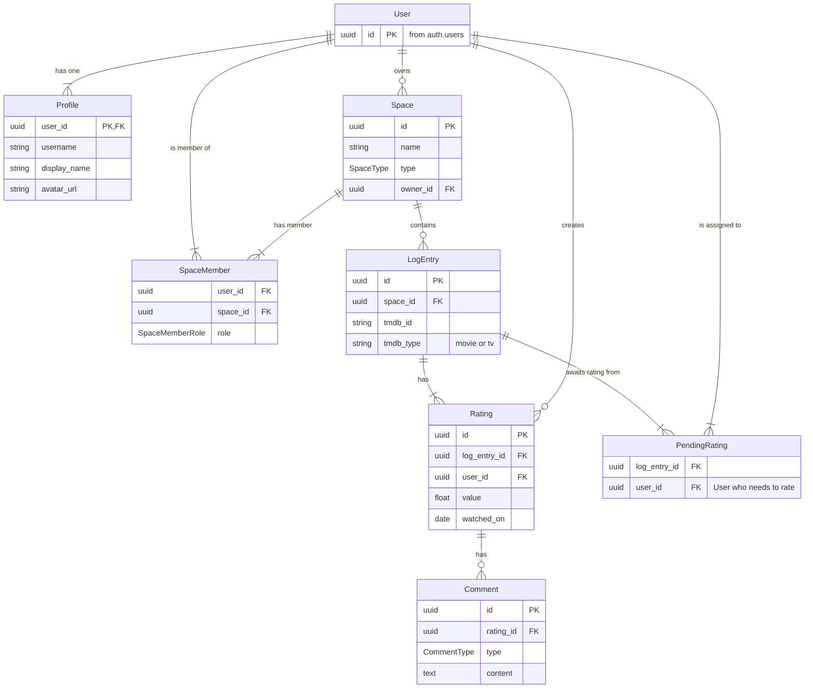

# Flicklog: Database Schema

This document is the source of truth for the Flicklog database design. It serves as the blueprint for the `prisma/schema.prisma` file. All schema changes should be proposed and reflected here first.

## Guiding Principles

### Database-Level Defaults for Cross-System Compatibility

When creating columns that need default values (like UUIDs for primary keys), we MUST use **database-level default generators** (e.g., `@default(dbgenerated("gen_random_uuid()"))`) instead of Prisma-Client-only functions (e.g., `@default(uuid())`). This ensures that raw SQL operations, such as our Supabase `handle_new_user` trigger, can successfully `INSERT` new rows without violating `NOT NULL` constraints, as the database itself will generate the value.

- **Normalize Data:** We avoid duplicating data. For example, movie details (title, poster) are not stored in our database; we only store the `tmdb_id` and fetch details from the TMDB API.
- **Supabase Integration:** The schema is designed to work seamlessly with Supabase Auth and Row Level Security (RLS).
- **Clarity over Cleverness:** The relationships and models should be straightforward and easy to understand.

## Entity-Relationship Diagram (ERD)

## Enums

### SpaceType

- `PERSONAL`: A private space for a single user.
- `SHARED`: A collaborative space for multiple users.

### SpaceMemberRole

- `ADMIN`: Can manage space settings and members. The space owner defaults to this role.
- `MEMBER`: Can log entries and comment.

### CommentType

- `QUICK_TAKE`: A short, public-facing summary.
- `DEEPER_THOUGHTS`: Longer, more private notes.

## Model Definitions

### User (Implicit)

- **Source:** This table corresponds to Supabase's `auth.users` table. We do not manage it directly.
- **Purpose:** Handles core authentication.
- **Primary Key:** `id` (UUID)

### Profile

- **Purpose:** Stores public-facing and app-specific user data. This keeps our user data separate from the auth system, which is a best practice.
- **Primary Key:** `user_id` (a one-to-one relationship with `auth.users`).
- **Key Fields:**
  - `username`: A unique, URL-safe username for profiles.
  - `display_name`: The user's chosen name.
  - `avatar_url`: Link to the user's profile picture.

### Space

- **Purpose:** The core organizational unit. A "scrapbook" for logging.
- **Key Fields:**
  - `type`: (`PERSONAL` or `SHARED`) - determines permissions and UI.
  - `owner_id`: The user who has ultimate control over the space.
- **Indexes:** An index on `owner_id` will be useful.

### SpaceMember (Join Table)

- **Purpose:** Manages user membership and roles within a `SHARED` space. This is central to our authorization logic.
- **Primary Key:** Composite key of `(user_id, space_id)`.
- **Key Fields:**
  - `role`: (`ADMIN` or `MEMBER`) - essential for permissions.
- **Logic:** For a `PERSONAL` space, only the owner will have an entry here.

### LogEntry

- **Purpose:** Represents a unique media item (e.g., "The Matrix," "Breaking Bad Season 1") that has been logged in a `Space`. It acts as a container for ratings from different users.
- **Key Fields:**
  - `tmdb_id`: The ID from The Movie Database.
  - `tmdb_type`: To distinguish between `movie` and `tv`.
- **Logic:** When a user logs a movie in a shared space for the first time, this entry is created. Other members then attach their `Rating` to it.

### Rating

- **Purpose:** A specific user's rating and context for a `LogEntry`. This is the "memory" itself.
- **Key Fields:**
  - `value`: A float (e.g., 4.5) for the star rating.
  - `watched_on`: The date the user watched the media.
- **Logic:** A single `LogEntry` in a shared space can have multiple `Rating` entries, one for each member who has rated it.

### Comment

- **Purpose:** Stores the "Quick Take" and "Deeper Thoughts" associated with a specific user's `Rating`.
- **Relationship:** Linked to `Rating`, not `LogEntry`. This ensures comments are tied to a specific user's experience.

### PendingRating (Join Table)

- **Purpose:** Explicitly tracks the "Your Turn!" feature. When a `LogEntry` is created in a `SHARED` space, entries are created here for all other members of the space.
- **Primary Key:** Composite key of `(log_entry_id, user_id)`.
- **Logic:**
  - **Creation:** When User A adds a `Rating` to a new `LogEntry` in a space with User B and C, two `PendingRating` records are created (for B and C).
  - **Deletion:** When User B submits their `Rating` for that `LogEntry`, their corresponding `PendingRating` record is deleted. The UI can then query this table to show a user their pending items.

---
